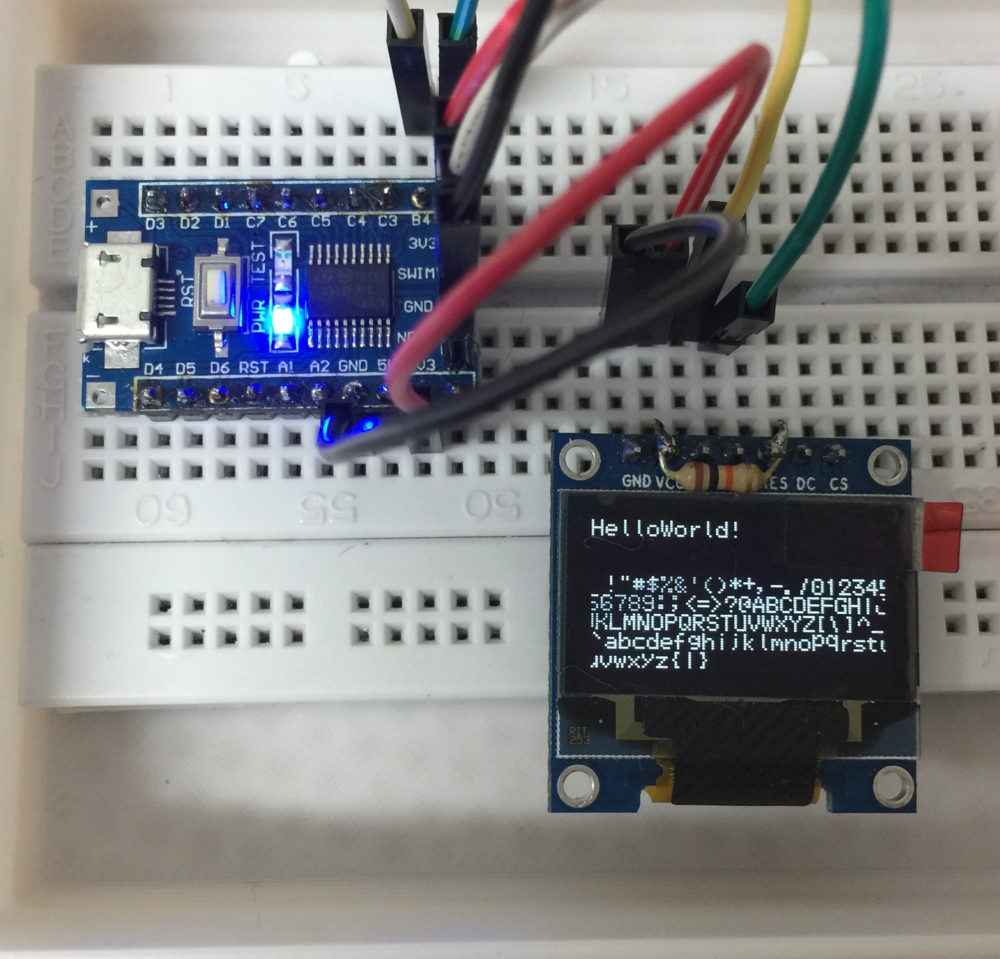

# micro-ssd1306
Minimal, bufferless implementation* of ssd1306 to print char(s)⌨️

## HowTo
- build with [sduino](https://github.com/tenbaht/sduino)
- fix `Makefile` to point to the location of your sduino install
- `make`

## It works...

## Foot Notes

*it's more of a hack job 😅
